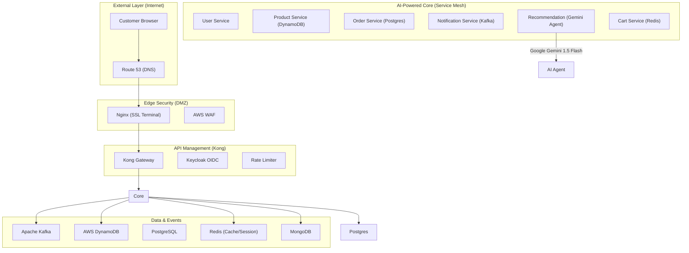

# 👕 Yamatee Club: Institutional-Grade E-Commerce Platform

[](https://spring.io/projects/spring-boot)
[](https://aistudio.google.com/)
[](https://konghq.com/)
[](https://www.keycloak.org/)
[](https://zipkin.io/)

Yamatee Club is an elite, cloud-native e-commerce ecosystem engineered for high availability, AI-integrated personalization, and multi-layer edge security. This project represents the "Gold Standard" architecture for modern SaaS applications.

---

## 🏗️ 1. Enterprise Architecture

The system implements a **DMZ-Edge-Core** security model, ensuring all traffic is validated, rate-limited, and encrypted before reaching business logic.

### 🗺️ System Topology


---

## 🛡️ 2. Security & Identity Management

- **Edge SSL Termination**: Nginx terminates TLS 1.3 at the entry point, offloading encryption from internal services.
- **Identity Hub (Keycloak)**: Centralized OAuth2/OIDC provider managing user federation and sessions.
- **Gateway Guard (Kong)**: Enforces JWT validation, CORS, and Rate Limiting for all protected routes.
- **Stateless Auth**: `user-service` issues secure JWT tokens with configurable expiration (RS256/HS256).

---

## 🧠 3. AI Reasoning Engine (Google Gemini)

The **Recommendation Service** uses **Google Gemini 1.5 Flash** for intelligent size advising.
- **Silhouetting**: Deductive reasoning based on height, weight, and silhouettes.
- **Hybrid Fallback Strategy**: If the AI API is rate-limited or unreachable, the system automatically reverts to a deterministic rule-based sizing algorithm to ensure 100% uptime.

---

## 🏗️ 4. Software Design Patterns

The backend code adheres to rigorous software engineering principles:

| Pattern | Implementation | Benefit |
| :--- | :--- | :--- |
| **Singleton** | All `@Service` and `@Repository` components in Spring Boot. | Memory efficiency and shared resource access. |
| **Observer** | `NotificationConsumer` listening to Kafka `user-registration` topics. | Decoupled asynchronous event processing. |
| **Strategy** | `GlobalExceptionHandler` mapping specific exceptions to HTTP codes. | Centralized business rule encapsulation. |
| **Builder** | Usage of Lombok `@Builder` for immutable DTOs and Entities. | Readable and safe object construction. |
| **Proxy** | Spring AOP for `@Transactional` and Resilience4j `@CircuitBreaker`. | Clean separation of cross-cutting concerns. |
| **Factory** | Spring's `BeanFactory` and custom DTO-to-Entity converters. | Controlled instantiation of complex objects. |

---

## 🚦 5. Resilience & Fault Tolerance (Resilience4j)

All inter-service communication is protected against "Cascading Failures" using the **Resilience4j** library:

- **Circuit Breaker**: `order-service` calls to `payment-service` and `product-service` will "trip" if failure rates exceed 50%, returning a graceful fallback instead of hanging.
- **Retry**: Automated retries for transient I/O and Socket exceptions (Exponential Backoff).
- **Bulkhead**: Limits concurrent calls to downstream services to prevent a single slow service from exhausting all system resources.
- **Rate Limiter**: Enforced at the Gateway (Kong) and Service levels to prevent DDoS and brute-force attacks.

---

## 💾 6. Polyglot Persistence Layer

| Database | Primary Role | Service Usage |
| :--- | :--- | :--- |
| **PostgreSQL** | Relational integrity & transactional safety. | `user-service`, `order-service` |
| **MongoDB** | Flexible document storage for metadata. | `product-catalog-service` |
| **Redis** | Extreme low-latency key-value access. | `shopping-cart-service`, Session tags |
| **DynamoDB** | High-performance NoSQL for catalog indexing. | `product-service` (via LocalStack) |
| **Kafka** | Distributed commit log for event-driven flows. | User registration, Order updates |

---

## 🚀 7. Quick Start & Deployment

### Clean Launch (Institutional Mode)
```powershell
# 1. Generate local SSL certs
make ssl

# 2. Rebuild backend (Ensures all configuration updates are included)
mvn clean install -DskipTests

# 3. Start the entire 15+ container stack
docker-compose down -v
docker-compose up -d --build
```

### System Access Table
| Tool | URL | Admin Creds |
| :--- | :--- | :--- |
| **Main Shop** | [https://localhost](https://localhost) | User-Created |
| **API Docs** | [https://localhost/api-docs/](https://localhost/api-docs/) | N/A |
| **Identity (Keycloak)**| [http://localhost:8080/admin](http://localhost:8080/admin) | `admin` / `admin` |
| **Tracing (Zipkin)** | [http://localhost:9411](http://localhost:9411) | N/A |
| **Monitoring (Grafana)**| [http://localhost:3001](http://localhost:3001) | `admin` / `admin` |
| **Mail Tester** | [http://localhost:1080](http://localhost:1080) | N/A |

---

## 🧪 8. API Verification Flows

- **User Flow**: `POST /api/users/auth/login` -> Returns JWT.
- **Catalog Flow**: `GET /api/products` -> Fetched from MongoDB + Redis Cache.
- **Order Flow**: `POST /api/orders` -> Transactions in PostgreSQL -> Kafka Event fired.
- **Notification Flow**: Listen to Kafka -> Send email via SMTP (MailDev).

---

> [!IMPORTANT]
> This platform follows a **12-Factor App** methodology and is ready for AWS EKS (Kubernetes) migration using the provided Terraform modules.
