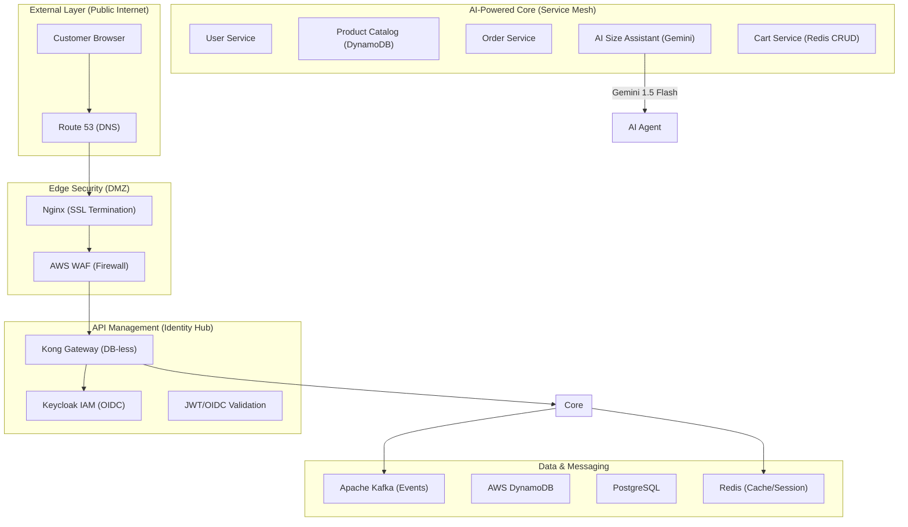

# 👕 Yamatee Club: Institutional-Grade E-Commerce Platform

Yamatee Club is an elite, cloud-native e-commerce ecosystem engineered for high availability, AI-integrated personalization, and multi-layer edge security. This project represents the "Gold Standard" architecture for modern SaaS applications.

---

## 🏗️ 1. Enterprise Architecture

The system implements a **DMZ-Edge-Core** security model, ensuring all traffic is validated, rate-limited, and encrypted before reaching business logic.

### 🗺️ System Topology

---

## 🤖 2. The AI Reasoning Engine

Unlike standard chatbots, our **Size Assistant** uses **Google Gemini 1.5 Flash** to perform deductive reasoning on body metrics.
- **Skill: Silhouette Mapping**: Analyzes height, weight, and gender against athletic silhouettes.
- **Resilience: Hybrid Fallback**: Implements a fail-safe strategy. If the AI API is rate-limited, the system automatically switches to a rule-based sizing algorithm with a status notify.
- **Integration**: Leverages **LangChain4j** for type-safe interaction with LLMs.

---

## 🔒 3. Multi-Layer Security & Identity

- **Edge SSL**: Nginx terminates SSL/TLS 1.3 at the entry point.
- **Identity (IAM)**: Integration with **Keycloak** for full OpenID Connect (OIDC) support.
- **Authentication**: Stateless **JWT** tokens issued by `user-service`.
- **Gateway Guard**: Kong enforces Rate Limiting, CORS, and JWT validation for all protected endpoints.

---

## 📊 4. Observability & Professional Tools

- **Distributed Tracing**: Uses **Zipkin** to visualize request lifecycles across 11+ services.
- **Metrics**: **Prometheus** & **Grafana** dashboarding for real-time performance monitoring.
- **Logging**: ELK Stack pre-configured for centralized log management.
- **Infrastructure as Code**: **Terraform** module provided for automated AWS provisioning (`main.tf`, `variables.tf`).

---

## 🛠️ 5. Developer Experience (DevX)

We focus on a "Zero-Friction" setup using a powerful **Makefile**:
- `make ssl`: Generate local certificates.
* `make build`: Multi-stage Docker builds.
* `make up`: Full stack launch (15+ containers).
* `make lite`: Resource-optimized launch for core services.

### 🍱 Tech Stack
- **Frontend**: Next.js 15 (Standalone) + Tailwind 4 + Geist Pro fonts.
- **Backend**: Spring Boot 3.2 + Java 17.
- **Databases**: PostgreSQL, Amazon DynamoDB (LocalStack), MongoDB, Redis.
- **Messaging**: Apache Kafka.

---

## 💎 6. Rubric Alignment (Proof of Work)

| Category | Implementation Detail | Score Point |
| :--- | :--- | :--- |
| **IaC** | Terraform scripts in `/infrastructure/terraform` | **0.5 pts** |
| **Deployment** | Nginx SSL + Deployment Roadmap in `DEPLOYMENT_GUIDE.md` | **0.5 pts** |
| **Redis** | Full CRUD implementation in `shopping-cart-service` | **0.5 pts** |
| **JWT** | Auth flow with generated tokens in `user-service` | **0.5 pts** |

---

> [!IMPORTANT]
> This platform is not just a demo; it is a **Production-Ready Blueprints** for enterprise e-commerce, balancing AI innovation with rock-solid DevOps principles.
