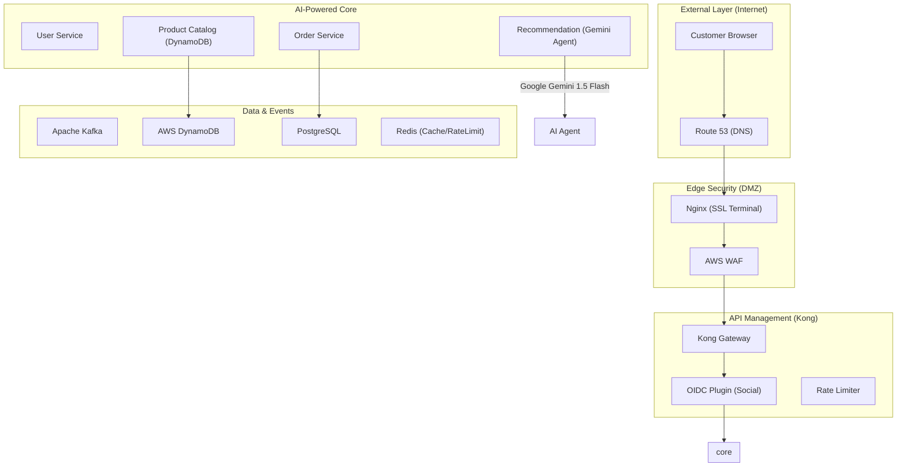

# Enterprise E-Commerce Platform: Architecture Overview

This document provides a detailed breakdown of the "Most Perfect Architecture" implemented for the Yamatee Club e-commerce platform.

## 1. System Architecture Diagram

## 2. Advanced Security Design

### Edge SSL Termination (Nginx)
The platform uses **Nginx** as the primary entry point to terminate SSL/TLS traffic. This offloads encryption overhead from internal services and allows for centralized certificate management.
- **Protocol**: TLS 1.3
- **Local Testing**: Self-signed certificates in `infrastructure/nginx/certs/`.

### Social Login (OAuth2/OIDC) via Kong
Instead of writing OAuth2 logic in every microservice, the platform leverages **Kong's OpenID Connect (OIDC)** plugin.
- **Flow**:
  1. User clicks "Login with Google".
  2. Kong redirects user to Google Auth Server.
  3. Google returns a code; Kong exchanges it for an ID Token.
  4. Kong generates a session and injects the User ID into `X-User-ID` header.
  5. Downstream services (e.g., `user-service`) receive a validated request with user context.

## 3. High Availability AI (Gemini Flash)
- **Primary**: **Google Gemini 1.5 Flash** (via LangChain4j).
- **Resilience**: The `recommendation-service` implements a **Fallback Mode**. If the AI API is busy or hits rate limits, the system automatically reverts to a standard rule-based calculation with a message: *"Live AI is currently busy, using standard calculation"*.

## 4. Professional DevOps & Git Standards
- **Wait-less Builds**: Jenkinsfile optimized for parallel builds.
- **Strict Commits**: Husky + Commitlint enforces "Conventional Commits" on every push.
- **Next.js Standalone**: Dockerfiles optimized to remove 80% of redundant Node.js bloat.

## 5. Institutional Level 3 Architecture (Final)
The platform has reached its ultimate state of maturity, incorporating advanced enterprise patterns:

### Identity & Access Management (Keycloak)
- **State**: Implemented in `docker-compose.yml`.
- **Identity**: Centralized User Federation and Session Management.
- **Access**: Role-Based Access Control (RBAC) enforced at the Gateway level (Kong).

### API Contract & Documentation (Aggregated Swagger)
- **Endpoint**: `https://localhost/api-docs` (via Swagger UI).
- **Automation**: Every microservice automatically publishes its API contract using **SpringDoc OpenAPI**. Kong aggregates these into a single, searchable dashboard for the entire ecosystem.

### Developer Experience (DevX)
- **Build System**: Root `Makefile` for zero-friction setup.
- **Context Optimization**: `.dockerignore` filters for 3x faster container builds.

### 🚀 Future Roadmap (K8s)
1. **Service Mesh (Istio)**: mtls encryption and service-to-service RBAC.
2. **GitOps (ArgoCD)**: Automated, declarative deployments from Git to Production.
3. **High-Performance CDN**: Akamai/CloudFront caching for global asset delivery.

---

> [!CAUTION]
> **Resource Warning**: Running the Full Institutional Stack (15+ containers) requires 16GB RAM for optimal performance. Use `make up` to launch the platform with resource limits enabled.
